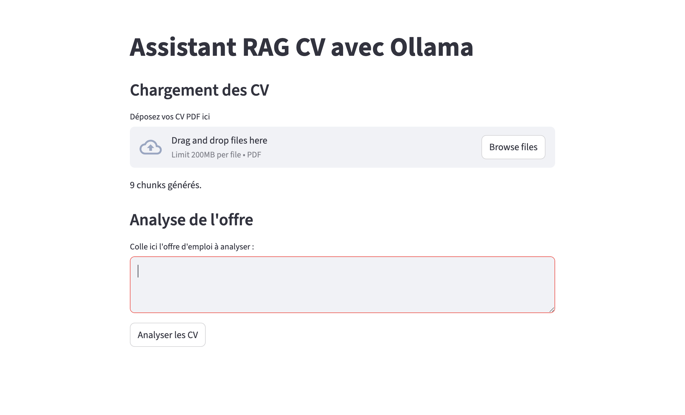

# Assistant IA d’Analyse Automatique de CV  
### RAG local avec Ollama + Mistral

Un assistant IA capable d’analyser plusieurs CV PDF et de les comparer à une offre d’emploi,
afin d’identifier automatiquement le candidat le plus pertinent.

-- Le projet fonctionne **entièrement en local**, garantissant la confidentialité des données RH.

---

##  Démo

- Interface web : Streamlit
- Analyse automatique des CV
- Score de matching (%)
- Forces / Gaps / Recommandations
- Identification du meilleur CV

  

  

  

---

##  Objectif du projet

Dans les processus de recrutement, l’analyse manuelle de CV est :
- chronophage
- subjective
- difficilement scalable

Ce projet vise à :
- automatiser le matching CV ↔ offre
- fournir une analyse explicable
- préserver la confidentialité des données

---

##  Fonctionnalités

- Upload de plusieurs CV PDF  
- Analyse sémantique des CV  
- Matching avec une offre d’emploi  
- Score de compatibilité (%)  
- Forces du candidat  
- Gaps techniques  
- Recommandations personnalisées  
- Sélection du meilleur CV  

---

##  Architecture (RAG)

1. Chargement des CV PDF
2. Découpage en chunks (800 tokens, overlap 150)
3. Embeddings sémantiques (Sentence Transformers)
4. Indexation vectorielle (ChromaDB)
5. Retrieval des CV pertinents
6. Génération de l’analyse via LLM local

---

##  Stack technique

- Python
- Streamlit (interface web)
- LangChain (pipeline RAG)
- ChromaDB (base vectorielle)
- Sentence Transformers (embeddings)
- Ollama (LLM local)
- Mistral (modèle de langage)

---

## Auteur

Hajar EL HIZABRI
Data Scientist

📎 GitHub : https://github.com/jira0325

📎 Medium : medium.com/@hajarbenzekri